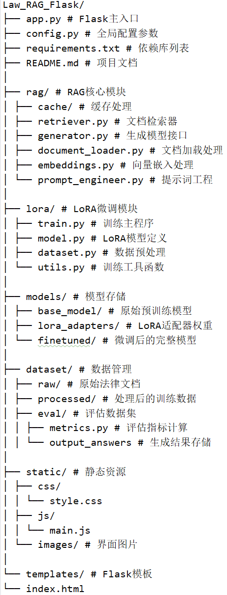

# 法海——智能法律顾问

##  简介
> 法海 AI 是一款基于先进人工智能技术打造的智能法律顾问系统。
> 它旨在为用户提供价值，满足他们在法律咨询方面的多样化需求。
> 无论是个人用户处理日常法律事务，还是企业应对复杂的商务法律问题，法海 AI 都能提供便捷、高效且专业的法律支持。
> 填补人们在法律知识和专业咨询资源获取方面的空白，助力用户更好地维护自身合法权益。

---

## 功能亮点
- **向量数据库**：根据问题检索相关知识输入模型帮助模型生成答案
- **模型**：基于Qwen2.5-7B，输入DISC-Law-SFT-Pair.jsonl，DISC-Law-SFT-Triplet-released.jsonl总计约16万条关于法律的问答对（法律文书总结，案件审判结果预判，提取案件关键信息，法考题目单选多选题，案件趋向对比....）lora微调而来
- **可扩展性**：向量数据库支持存储多种文档类型的嵌入存储，可以根据用户需求更改数据库内容
- **支持语音输入输出**：提升用户体验
- **多轮对话历史记录**：存储用户10轮对话内容，提升模型上下文回答准确度

---

## 快速开始
```bash
### 安装依赖
pip install -r requirements.txt

### 基座模型，嵌入模型(存放到models目录)
git clone https://hf-mirror.com/Qwen/Qwen2.5-7B

git clone https://hf-mirror.com/jinaai/jina-embeddings-v3

### 构建向量数据库（需提前安装好jina-embeddings-v3模型）
python ./rag/db_store.py

### 启动项目
python app.py

```
## 模型评估分数




